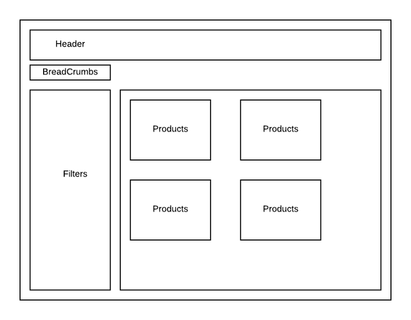
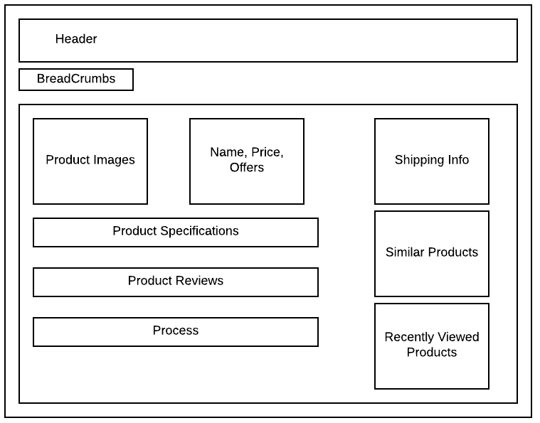
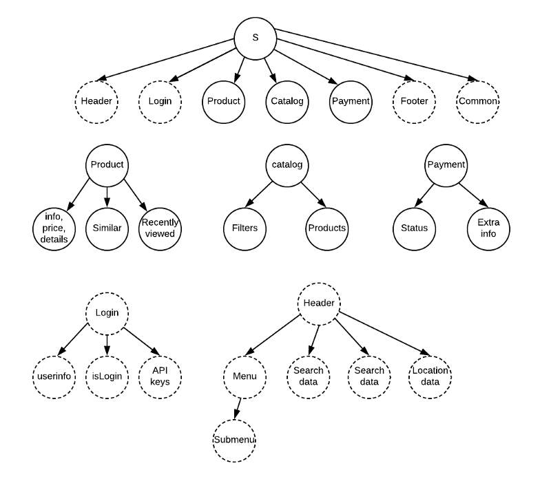

# redux notes

<!--
ID: b0b68aad-e324-4463-b947-b08cec465488
Status: draft
Date: 2020-05-28T14:09:32
Modified: 2020-05-28T14:09:32
wp_id: 1193
-->

redux 的文档是非常差的。它只写了 What 和 How, 而没有写 Why. 这就让初学者感到非常地迷惑，实际上它只要提到一下 "Event Bus" 这个词就非常容易理解了，非要上来就讲什么 Action/Store/Reducer/SingleSourceOfTruth 之类的。根据最高指示：代码是用来读的，不是用来装逼的，俗称 "码读不装", 那么我们这里先来补上 redux 的 Why.

## Why Redux?

redux 本质上来说就是一个 Event Bus, 或者 Message Queue. [这两篇](https://www.zhihu.com/question/63726609/answer/212357616)[文章](https://www.zhihu.com/question/63726609/answer/934233429) 写得非常好了。

## What

Redux 里的概念特别多，不过知道了 EventBus, 就都非常好理解了，这里先列出来：

- store, 存放状态的唯一容器
- reducer, 就是用来处理消息的函数，其实一般叫做 handler, 起个 reducer 的名字好像就函数式了，瞬间高大上加逼格高了起来。这个函数签名是 function(state, action) -> new_state.
- action 和 dispatch, Action 其实就是消息总线里面的消息或者说事件，分发 Action, 其实不就是生产者么？
- actionCreator, actionCreator 就是用来创建 Action 的。Action 不过就是一个 {type, value} 的字典罢了。function xxxCreator() -> action 就叫做一个 actionCreator
- Middleware, 其实就是字面意思，会处理你的状态的一些中间件。

```js
import {createStore} from "redux";

function reducer(state = {}, action) {
  switch (action.type) {
    case "XXX":
      return {
        ...state,
        XXX: action.value
      };
    case "YYY":
      return {
     
      }
    default:        
      return state;
  }
}

let store = createStore(reducer);

store.dispatch({type: "XXX", value: "XXX"})

console.log(store.getState())
```

以上就是一个非常基本的 redux 应用啦，如果要有多个 reducer 分开处理不同事件怎么办呢？使用 combineReducers. 需要注意的是，这样的话，每个 reducer 只会获得其中一部分数据了，比如说 userReducer 只会获得 user 部分，itemsReducer 只会处理 items 部分。

```js
import {createStore, combineReducers} from "redux";

let reducers = combineReducers({
  user: userReducer, items: itemsReducer
})

let store = createStore(reducers)
```

## React-Redux

在上面的例子中，实际上完全没有涉及到 react 的相关内容，redux 本身就是可以独立存在的一个库。但是，99.99% 的情况下，你还是为了管理 react 的状态采用 redux 的。要在 react 中使用 redux , 需要使用 react-redux 库。

这里需要注意的是，都 2020 年了，我们自然要用 hooks 了，所以网上好多还在讲 connect 的教程可以不用看了。几个常用的钩子：

- useSelector, 顾名思义，用来从 store 中选取需要的状态，相当于 consume
- useDispatch, 用来 dispatch action, 相当于 produce
- useStore, 这个明确说了不推荐用

```js
// yarn add react-redux
import {useSelector, useDispatch} from "react-redux";

const result = useSelector((state) => selectedState)
// const result = useSelector((state) => state.counter)

const dispatch = useDispatch()
// 这里需要用一个匿名函数
<button onClick={() => dispatch({ type: 'increment-counter' })}>
  Increment counter
</button>
```

### 不使用 hooks 的方式

在没有 hooks 之前，需要使用 react-redux 库提供的 connect/mapState/mapDispatch 几个函数来实现 redux 和 react 组件之间的交互。

- useSelector 对应以前的 mapState 函数
- useDispatch 对应以前的 mapDispatch 函数

## side effects 和 thunk

从上面的脚本我们可以看出，redux 完全是一个本地的消息处理，然而当我们在本地做出更改的时候，肯定需要在放到服务器啊，这种操作在 redux 中被称作 side effects（副作用）, 可以使用

## 何时发送数据请求？

对于需要获取数据的操作，一般需要三个 Action, 分别是 `FETCH_XXX_BEGIN/SUCCESS/FAILURE`.

在 class-based React 中，一般是在 ComponentDidMount 周期中调用加载数据的逻辑，我们现在自然是使用 useEffect 的这个钩子来实现。

在老的 app 中，需要使用 connect 和 mapStateToProps/mapDispathToProps 函数，本质上和 useSelector/useDispatch 是一样的。

## 设计 redux state tree

我们知道 redux 的 state 是作为一个树存在的，设计这个树的形态是 redux 使用的重中之重了。

第一个问题，是否需要把所有的状态放进 redux 呢？不一定，对于一些组件内部的 UI 状态，比如是否隐藏某个按钮，是可以使用 useState 放在内部的。重点在于：你这个状态其他组件关心吗？一般来说，表单的状态时不需要放进 redux 的。

第二个问题，对于多个页面，比如说：一个列表页，一个详情页，一个用户页，要把所有的状态放在一个 store 中么？我倾向于把同一个组的页面的数据放在同一个 State 里面，这里的组大概就相当于 Django 的 App 或者是 Flask 的 Blueprint 的概念。当然，对于小型项目来说，用一个 store 就够了。

总的来说，分以下四步：

1. 确定全局状态，比如用户登录状态
2. 设计当前页面分区可视化树
3. 根据页面布局，确定组件，以及每个组件的状态。





## redux 项目目录结构

只要分着放 actions 和 reducers 两个目录就可以了，其实没多大要求。

## 参考

1. [Redux 的本质，Event bus](https://www.zhihu.com/question/63726609/answer/934233429)
2. https://stackoverflow.com/questions/50703862/react-redux-state-shape-for-multiple-pages
3. https://stackoverflow.com/questions/37288070/designing-redux-state-tree
4. https://stackoverflow.com/questions/33619775/redux-multiple-stores-why-not
5. [Redux App 设计流程](https://www.freecodecamp.org/news/the-best-way-to-architect-your-redux-app-ad9bd16c8e2d/)
6. https://www.pluralsight.com/guides/how-to-structure-redux-components-and-containers
7. https://www.pluralsight.com/guides/how-to-organize-your-react-+-redux-codebase
8. [使用 hooks 编写 redux](https://zhuanlan.zhihu.com/p/70380695)
9. https://medium.com/@gaurav5430/async-await-with-redux-thunk-fff59d7be093
10. https://medium.com/fullstack-academy/thunks-in-redux-the-basics-85e538a3fe60

### 如何加载数据

1. https://stackoverflow.com/questions/51113369/how-to-dispatch-fetched-data-from-api
2. https://stackoverflow.com/questions/39419237/what-is-mapdispatchtoprops
3. 