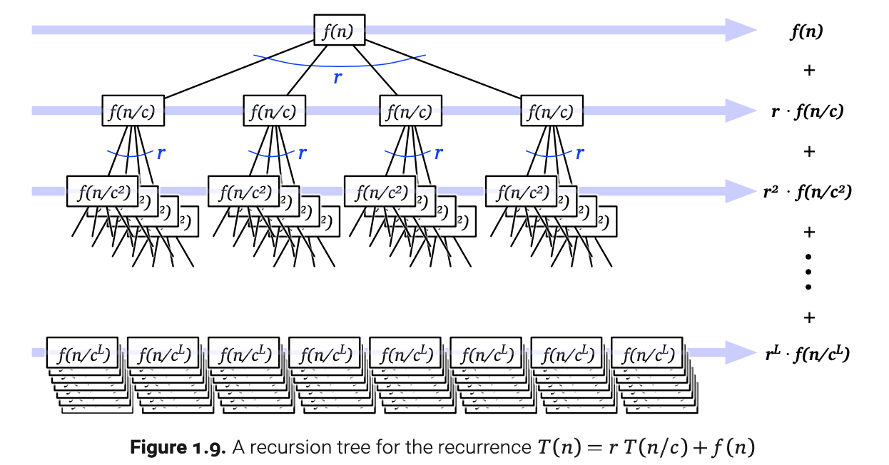

# 面试刷题总结（二） - 分治

<!--
ID: 5fe60596-9716-4754-91f0-449a2578213d
Status: publish
Date: 2020-01-30T00:00:00
Modified: 2020-07-29T23:37:30
wp_id: 1687
-->

分解 -> 解决子问题 -> 合并

## 分治的时间复杂度

正如上一节所说的，分治问题在递归过程中实际上是遍历了状态空间树，所以时间复杂度的计算也需要根据树的高度和每一层的时间复杂度来计算。



    T(n) = a T(n/b) + f(n), if f(n) ∈ O(n^d), d >=0
    T(n)∈ { 
        O(n^d), a < b^d;
        O(n^d logn), a = b^d;
        O(n^(logba), a > b^d;
    }

通过 O(n) 的时间，把 n 的问题，变为了两个 n/2 的问题，复杂度是多少？

    T(n) = 2T(n/2) + O(n)
        = 2 * 2T(n/4) + O(n) + O(n)
        = n + nlogn
        ≈ O(NlogN)

通过 O(1) 的时间，把 n 的问题，变成了两个 n/2 的问题，复杂度是多少？

    T(n) = 2T(n/2) + O(1)
        = 2 * 2T(n/4) + O(1) + O(1)
        = n + (1 + 2 + 4 +…+ n)
        ≈ n + 2n
        ≈ O(n)

对于 O(nlogn) 的算法 T(n) = 2T(n/2) + O(n)

证明一般采用数学归纳法，反证法

## 改变函数签名与参数传递

参见递归中的说明

## 例题

### LeetCode 241

```Python
class Solution:
    def diffWaysToCompute(self, s: str) -> List[int]:
        if s.isdigit():
            return [int(s)]
        ans = []
        for i in range(len(s)):
            if s[i] in ("+", "-", "*"):
                left = self.diffWaysToCompute(s[:i])
                right = self.diffWaysToCompute(s[i+1:])
                for l in left:
                    for r in right:
                        if s[i] == "+":
                            ans.append(l+r)
                        elif s[i] == "-":
                            ans.append(l-r)
                        else:
                            ans.append(l*r)
        return ans
```

## 参考资料

1. https://mp.weixin.qq.com/s?__biz=MzUyNjQxNjYyMg==&mid=2247487045&idx=3&sn=e9f67f1fd33649c60478638c1d6cc2d9
2. https://oi-wiki.org/basic/divide-and-conquer/