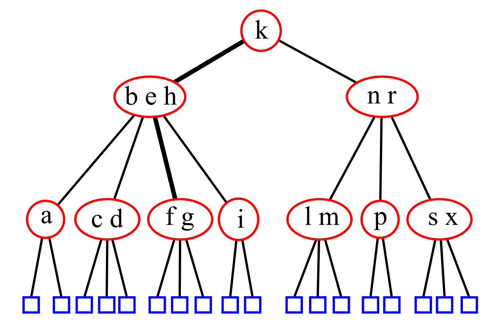
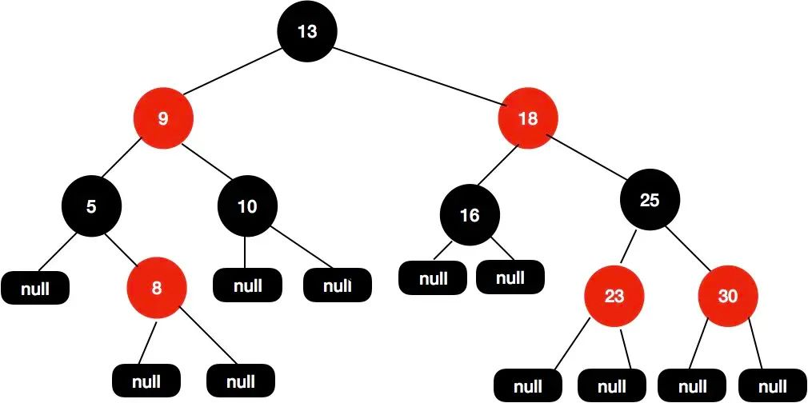

# 面试刷题总结（七） - 树和图

<!--
ID: d37ebf16-dec5-4f4a-890a-49e3719df64b
Status: publish
Date: 2019-10-23T00:00:00
Modified: 2020-07-29T23:37:30
wp_id: 1689
-->

## 图的表示方法

标准的表示方法应该是邻接表。在邻接表中我们使用链表来表示相邻节点。

## 任意优先搜索（Whatever First Search）

这是 Jeff Erickson 在书中提到的搜索算法框架，一个框架就综合了所有遍历算法。

树的遍历实际上和图的遍历完全一样，只是不需要标记有没有访问过当前节点。

```
WhateverFirstSearch(s):
  把 s 放入 bag
  while bag 非空：
    从 bag 取出 v
    if v 未标记：
      标记 v
      for 每个边 vw:
        把 w 放入 bag 中
```

如果 bag 的算法选用 stack，那么就可以实现深度优先遍历，如果选用 queue 就可以实现广度优先遍历。

如果选用 priority queue，那么就可以实现最优优先遍历。

1. 如果我们使用每个边作为排序依据，那么就可以得到最小生成树，也就是传说中的 Prim 算法。
2. 如果我们使用 `dist(v) + w(v->w)` 作为排序依据，那么就得到了传说中的 Dijkstra 算法。其中 `dist(v)` 为从源点 s -> v 的距离。
3. 未完待续

对于没有连通的图，我们还可以使用 `WFSALL` 来遍历所有节点

```
WFSALL(G):
  for 所有节点 v:
    取消标记 v
  for 所有节点 v:
    if v 未标记：
      WhateverFirstSearch(v)
```

## 深度优先搜索

深度优先搜索实际上就是上面的 `任意优先搜索` 算法的特例化

```
DFS(v):
  标记 v
  PreVisit(v)
  for 每个边 vw:
    if w 未标记：
      parent(w) <- v
      DFS(w)
  PostVisit(v)
```

其中的 PreVisit 和 PostVisit 就是我们可以插入的目标函数，通过改变这两个函数就可以实现不同的算法。

### 拓扑排序

拓扑排序就可以简单地使用深度优先搜索实现，只不过在最后需要把顺序倒过来。

```
TopologicalSort(G):
  pass
```

二叉树外部节点总是等于内部节点加 1

## 解决树问题的思路

树的最大问题在于要**从底层叶节点开始思考**，而不是自上而下看图。递归是从基础 case 开始向上递归的。一定要画出访问的顺序图。


1. 对于任何树的问题，还是优先考虑递归，因为树本身就是一个递归性质的数据结构。
2. 树还是天然 Devide and Conquer 的，也就是说可以分层左右两个树分别处理，然后合并得到答案。

解树的问题就只有两种方法：

1. 分治：*后序遍历*，并通过左右子树和根节点一起解决问题。

```
        1
      /   \
    2      3
  /  \   +---+
4      5   B
+------+
    A
```

2. 遍历：在遍历过程中解决问题，比如记录最大值等。

    

对于树的题目，到底是迭代解还是递归解呢？

**最好写递归解*，比较简单。写迭代性解首先考虑栈。函数调用过程本来就会用到栈使用栈可以模拟递归调用。使用栈还可以把需要反转的操作自动反转。比如在 zigzag 层序遍历的时候。

递归的出口是选 NULL 还是叶子节点？

最好选择 null，具体来说：

1. 有一个 corner case 是直接就传一个 null 的节点进来，所以要选 null
2. 叶子节点比较复杂，只要判断 null 的 return 之后结果 ok, 就 null

## 改变函数签名与参数传递

参考回溯文档中的讲解

## 常见问题总结

### 遍历

参考 [这里](../solutions/tree.md)

## 二叉查找树

一定是用中序遍历来解的

## 其他常见的树

### 2-3-4 树

234 树的意思是每个节点的子节点可能有 2、3、4 个，所有的叶节点都在同一深度。



#### 插入

对于 2-节点和 3-节点，显然是比较简单的，我们只要直接插入就行了。对于 4-节点来说，我们不能插入。不过解决方法也很简单，我们把 4-节点分裂，然后把中间节点提到上一级，然后就有两个 2-节点了，这时候就可以插入了。


在自上而下插入的过程中，我们还会把遇到的每一个 4-节点都分裂，这样保证了我们

### 红黑树

红黑树是为了解决二叉查找树不平衡的问题发明的。



1. 每个节点要么是红色，要么是黑色。
2. 根节点永远是黑色的。
3. 所有的叶子节点都是空节点（即 null），并且是黑色的。
4. 每个红色节点的两个子节点都是黑色。（从每个叶子到根的路径上不会有两个连续的红色节点。）
5. 从任一节点到其子树中每个叶子节点的路径都包含相同数量的黑色节点。

Null 也算节点，从头到尾都是黑色节点，红色节点只能是内部节点。每条路径都包含相同的黑色节点。

红黑树保证的是没有一个节点长度是其他路径的 2 倍，而不是每一个路径之间的差在常数倍，比如说下面这个树。


为了保证平衡，也就是第 5 个条件，插入的新节点必须是红的，如果恰好插入到了一个黑色节点下面，那就结束了，如果插入到了一个红色节点下面，需要调整。

### 跳表

跳表显然不是一颗普通意义上的树，但是因为他的时间复杂度和红黑树类似，并且实现起来简单，不容易出 bug，所以很多时候，都把跳表作为红黑树的一个替代来使用，比如在 Redis 中。

### B 树

B 树用于基于硬盘的数据库的索引。为什么不直接用二叉树呢？B 树本质上来说就是 2-3-4-n 树，因为硬盘读取相对于内存访问来说实在太慢了，所以减少树的层级有利于提升速度。

### 更多的树

有些题看起来是树，实际上是利用递归关系的，或者只是利用到了一个性质，但本质上是其他问题

## 参考资料

1. https://stomachache007.wordpress.com/2017/03/12/%E4%B9%9D%E7%AB%A0%E7%AE%97%E6%B3%95%E7%AC%94%E8%AE%B0-3-binary-tree-divide-conquer/
2. https://blog.csdn.net/yang_yulei/column/info/easydatastruct
3. https://web.archive.org/web/20200112020131/https://merunas.io/tree-data-structures/
4. 《数据结构与算法分析：C 语言描述》
5. https://stackoverflow.com/questions/8765558/why-dont-we-use-2-3-or-2-3-4-5-trees