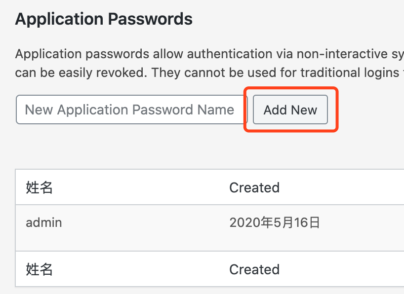

# WordPress 的 API

Date: 2019-10-10

## 操作步骤

1. 把 WordPress 的文章都同步到本地
2. 整理文章
3. 把本地文章再发布到 WordPress

## Basic Auth 插件

通过安装 https://wordpress.org/plugins/application-passwords/ 可以让 WordPress 支持通过 Token 访问，避免的复杂的登录和 Cookie 等认证。

安装这个插件之后，在用户的管理界面可以选择添加 token。然后我们就可以通过 Basic Auth 访问了。



我们可以查询 WordPress 的标准 RESTful API。

```py
import requests
import json
import base64

user = 'username'
pythonapp = 'G4kN hBNh r35J luXk aXyd n6Lm'
url = 'https://example.com/wp-json/wp/v2'

token = base64.standard_b64encode(user + ':' + pythonapp)
headers = {'Authorization': 'Basic ' + token}

post = {'date': '2017-06-19T20:00:35',
        'title': 'First REST API post',
        'slug': 'rest-api-1',
        'status': 'publish',
        'content': 'this is the content post',
        'author': '1',
        'excerpt': 'Exceptional post!',
        'format': 'standard'
        }

r = requests.post(url + '/posts', headers=headers, json=post)
print('Your post is published on ' + json.loads(r.content)['link'])
```

## 参考

1. https://discussion.dreamhost.com/t/how-to-post-content-to-wordpress-using-python-and-rest-api/65166
2. https://developer.wordpress.org/rest-api/reference/posts/#create-a-post
