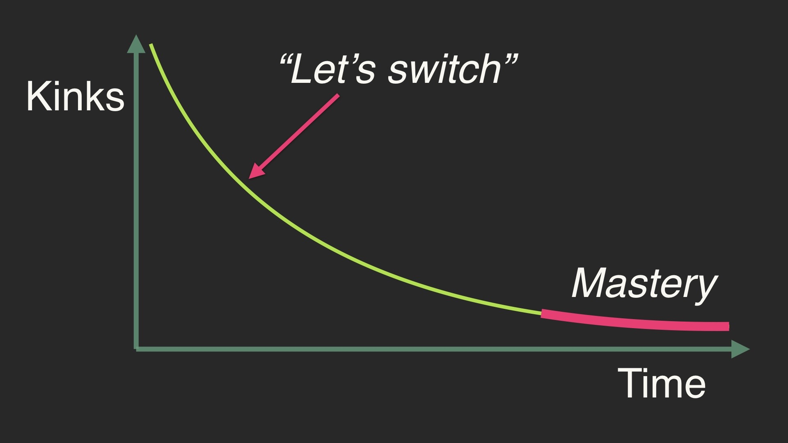

# 创业公司应该选择无聊的技术

<!--
ID: ae1b7a72-8c8d-4fff-8d46-986fe94de56a
Status: publish
Date: 2020-07-30T21:38:33
Modified: 2020-07-30T21:38:33
wp_id: 1839
-->

## 感想

昨天又重新读了一下 Boring Technology 和 Boring Company 两篇文章，得出对于创业公司技术选型的一些想法。

1. 创业必须是老鸟，老鸟已经知道了足够的技术，有足够的技术可供选择，才能有全局思考选择最合适的少数几个技术。
2. 什么是 Boring Technology？Boring 也不能无脑，Oracle 和 MySQL 都已经足够成熟且无聊了，但是 Oracle 显然不是未来的方向，所以我们肯定要选择 MySQL。
3. 对于新手来说，显然是不适合创业的。别扯啥比尔盖茨和扎克博格的例子，人家高中水平比不少五年工作经验的人都高。新手还需要足够的时间了解足够的技术知识。就像文中说的一样，每个人的精力是有限的，创业不能把精力都放在技术选型上，更多地是实现商业逻辑。
4. 作为一个技术人员，或者说技术公司，还是应该固定地花费时间去学习新技术或者更基础的底层技术，比如 20%时间、串讲或者黑客马拉松。否则的话，因为对于技术的追求被压抑了，可能反倒倾向于在生产环境中引入各种 fancy 的新技术而引起问题。
5. 总体来说，还是哪句话：不要因为手里拿着锤子就看哪里都是钉子。但是工具箱里一定要有锤子，不然看到钉子了你就傻眼了。锤子应该放在工具箱里，需要的时候用一下，而不是一直攥在手里。
6. 运维团队的一个核心 KPI 就是组织开发人员增加一些功能重复的组件，比如 Python vs Ruby, Redis vs Memcached, Influxdb vs Prometheus.
7. build from what you really need

## 原文的一些摘抄

- 很重要的一步是认识到注意力是非常宝贵的，人类对于细节的把控粒度是有限的。
- 我的朋友 Andrew 每天穿着同一个牌子的黑衬衫。他认为如果他节省下选择衣服穿的脑力，就可以存起来用到别的事情上。
- 我们应该选择能够覆盖我们问题的最小工具集，然后把工作搞定。
- 增加一项技术是容易的，但是和它共存很难
- 我可以随时 `brew install` 一个数据库，并且开始往里写数据，但是要在生产环境运行数据库就是另一个技能了。
- 如果你给不同的团队做出局部选择的权力，那么在你是在全局性地伤害自己。
- 当你使用多个相同功能的服务的时候，你不只要付出多一分的维护精力，还要失去大家使用同一个平台的好处。
- 技术对你的公司有全局影响，不应该交给单独的工程师们自己决定。
- 如果你觉得你用现有的工具无法实现某个新功能，那么一般是你想的不够用力
- 你可以把你觉得很难实现的功能写下来，然后就就会发现并没有那么难，至少比维护一个新的工具要简单。
- 当然你有可能得到相反的结论，使用一个新的工具也许是值得的。
- 如果你正在添加一项冗余的技术，那么你应该尝试着替换掉旧的工具，而不是维护两套。也应该准备着如果新的工具不好用的话，要回滚。
- 优先做能够让你集中精力到真正重要的事情上的事情。
- 全局思考你要做什么，选择一组最小的工具能够解决你所有问题的。
- 有意思的是你选择的任何工具可能都不是"正确的工具". 但是他们组合起来依然可能是正确的选择。

熟练使用你选择的工具非常重要。你应该往马斯洛需求模型的上面爬，关心大局。你不应该每天都在讨论要使用那个数据库，而应该是跟高阶的业务问题。如果你真的真么做的话，问问自己是不是哪里搞错了。

我们生活在一个创建公司的美妙年代，有那么多直接可用的工具和服务可以让我们解决时间和金钱并提高生产力。从来没有像现在这样，一个小团队（甚至一个人）可以使用简单无聊的技术来做出一点对世界有用的工具来。

大多数时候，构建和交付的最大障碍来自**想得过多**。如果这样怎么办，那样怎么办。天啊，你根本不重要。每个人都很忙的。没人关心你和你创造的东西，知道你证明你值得别人的注意力。即使你把第一次产品发布搞砸了，几乎不会有人注意到。Think big, start small, act fast. 使用无聊的技术来做一些简单的东西（甚至很丑）, 只要你解决了实际问题。

你的过度思考就是我的优势所在。

## 最后

Boring technology 的思路和 Facebook 工程师的文章 [4] 看似是冲突的。一个强调使用各种"无聊的"的技术，而另一个则是炫耀各种高级的基础设施。其实两个并不是矛盾的，反倒是统一的。无聊的技术才是经过大规模检验的基础设施，而其他高级设施要按照自己的思路，而不是看到乱七八糟的东西为了用就用。

Happiness comes from shipping stuff. 快乐源自交付。

## 参考

1. [Choose Boring Technology](http://boringtechnology.club/)
2. [The Boring Technology Behind a One Person Company](https://www.listennotes.com/blog/the-boring-technology-behind-a-one-person-23/)
3. [引入开源库的取舍](https://www.jianshu.com/p/eb58264936a6)
4. [FB 海归国内高管：谈谈 infra、代码管理、微服务、测试系统，以及技术人员海归能做什么](https://mp.weixin.qq.com/s?__biz=MzA4NzM3MTkzNw==&mid=2652385636&idx=1&sn=4a1a265746e0dcb2d4e27720d34dab82)